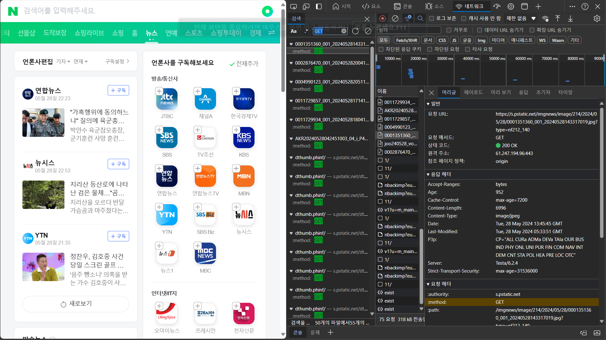

## HTTP 통신 메소드
### GET method

네이버 검색시 사용됨
### POST method

네이버 로그인시 사용됨
### PUT method

### PATCH method

chat gpt에서 chat을 삭제할때 사용됨
### DELETE method

## HTTP/1.1, HTTP/2, HTTP/3의 차이점과 역사
### HTTP/1.1
- 1997년 초에 발표  
- 표준 프로토콜  
- 텍스트 프로토콜  

### HTTP/2
- 이진 프로토콜  
- 다중화 프로토콜: 동일한 연결을 통해 병렬 요청을 수행 가능  
- 헤더를 압축  
- 클라이언트 캐시에 데이터를 저장 가능

### HTTP/3
- 전송 계층에서 TCP대신 QUIC를 사용  

출처 : https://developer.mozilla.org/ko/docs/Web/HTTP/Basics_of_HTTP/Evolution_of_HTTP